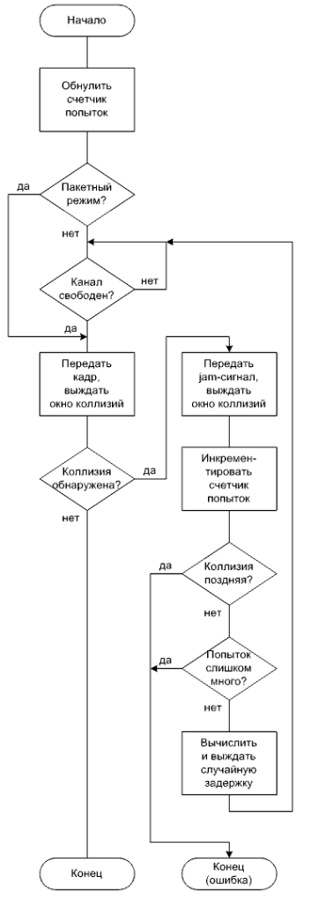

# Теоретические основы компьютерных сетей  

 ***Лабораторная работа №1***  
**Тема:** *Асинхронная двунаправленная передача данных*  
**Задание** :  
1.Создать приложение с графическим интерфейсом, которое будет имитировать станцию.  
2.В окне приложения должны содержаться 3 поля: Input, Output, Debug & Control.  
3.В поле Input вводится сообщение и посимвольно передаётся другой станации через COM-порт.  
4.В поле output должны отображаться полученные символы.  
5.В поле Debug & Control должна быть реализована возможность выбора COM-порта и подключения к нему, просмотра параметров COM-порта, а так же настройка параметров.  
6.Параметры порта: BaudRate, Parity, StopBits, DataBits.  

 ***Лабораторная работа №2***  
**Тема:** *Пакетная передача данных*  
**Задание** :  
1.Создать приложение на базе 1 лабораторной работы.  
2.Вместо посимвольной передачи данных реализовать пакетную передачу данных.  
3.Структура пакета:  
 1) Заголовок (Header)  
  флаг начала пакета -- 1 байт = 00001110  
 2) Адрес доставки (Destination address)  
 1 байт  
 3) Адрес отправителя (Source address)  
 1 байт  
 4) Полезное тело пакета -- поле данных  
 7 байт  
 5) Байт Frame Check Sequence(FCS)  
 1 байт  
 Возможные значения FCS:   
 0 - успешная передача данных  
 1 - ошибка при передачи данных  
 
4.Реализовать битстаффинг(bitstuffing) при передачи данных  и дебитстаффинг(debitstuffing) при приёме.  
5.До тех пор, пока пакет не сформирован, передача данных не производится, то есть принцип работы программы станет следующим:  
 формирование пакета ---> битстаффинг ---> пересылка ---> дебитстаффинг ---> проверка FCS ---> отображение.  
6.Изменить поле Debug & Control:  
 1) Добавить возможность выбрать адрес получателя и собственный адрес.  
 2) Добавить checkbox, который будет отвечать за симуляцию ошибки (за установку FCS в 1) .  
 3) Добавить поле для вывода отладочной информации.  
 4) При отправке пакета выводить в поле для отладочной информации содержимое пакета в шестнадцатиричном виде до и после битстаффинга.  
 5) При получении пакета выводить в поле для отладочной информации содержимое пакета в шестнадцатиричном виде до и после дебитстаффинга.  
 
  ***Лабораторная работа №3***  
**Тема:** *Канальное кодирование*  
**Задание** :  
1.Создать приложение на базе 2 лабораторной работы.  
2.Реализовать помехоустойчивое кодирование информации посредством циклического избыточного кода (Cyclic Redundancy Code -- CRC)  
3.Поле FCS в пакете теперь должно содержать остаток от деления на порождающий полином.  
4.Размер поля FCS в пакете задать таким, чтобы в нём можно было разместить остаток от деления.  
5.Кодирование выполнять классическим алгоритмом, т.е. деление столбиком, как на бумаге.  
6.Входные условия: код должен обнаруживать и исправлять одинарную ошибку.  
7.Checkbox, который отвечал за установку FCS в 1, теперь отвечает за создание ошибки в пакете (инверсия случайного бита).  
8.Отображать информацию об ошибке в поле Debug & Control.  
**Примечание:**  
В данной работе в качестве порождающего полинома выбран полином x^7 + x + 1, что соответствует числу 131.  
 **Как выбирать полином?**  
 
 1) Определить кодовое расстояние (**d_min**) -- это будет число единиц в двоичном представлении полинома.  
 2) Определить размер входных данных (**D**), т.е. сколько бит необходимо закодировать.  
 3) log2(D), округлённый до большего целого (т.е. 6.1 округляется до 7) - степень порождающего полинома, а размер поля, в котором должен храниться остаток от деления, на 1 больше степени полинома. Например, если степень полинома равна 7, то необходимо 8 бит для хранения остатка.  
 
 **Как это вообще работает?**  
 
 Рассмотрим случай данной лабораторной работы. Код должен обнаруживать и исправлять одинарную ошибку. Отсюда можно определить минимальное кодовое расстояние по следующей формуле:  
 
 **d_min** = **r** + **s** + 1,  
 
где **r** -- число обнаруживаемых ошибок, **s** -- число исправляемых ошибок.  
Размер данных, которые нужно закодировать -- 1 байт заголовка паке а, 2 байта с адресами, 7 байт с данными, то есть общий размер -- 10 байт, или 80 бит. log2(80) = 6.322, что округляется до большего целого, т.е. до 7 - степень порождающего полинома.  
Размер поля FCS на 1 больше, чем степень полинома, т.е. нам необходимо 8 бит для хранения остатка.  
Теперь необходимо получить остаток от деления.  
Код CRC основан на целочисленном делении с остатком. Если некоторое целое число поделить на другое целое число, меньшее, чем первое, то в результате мы получим целую часть и остаток. А что будет если этот полученный остаток "приплюсовать" к исходному числу? Правильно - остаток от деления станет равным 0.   
На этом и основан CRC код. Входные данные представляются большим двоичным числом, которое надо сдвинуть влево на размер остатка, который мы высчитали ранее, чтобы оставить место для "доплюсовки" остатка. Это свободное место изначально заполняется нулями, чтобы при суммировании не возникли переносы в старшие разряды, которые изменят исходные данные. Далее выполняется делени, получается остаток и добавляется к изначальным данным. Если при передаче пакета будут помехи и содержимое пакета изменится, результат деления на тот же самый порождающий полином уже не даст нулевой остаток, что будет сведетельствовать о присутствии ошибки.  
Исправление же ошибки в данной работе реализовано последовательной инверсией всех бит и проверкой остатка от деления. Если остаток стал 0, то ошибка исправлена, если же не 0, то выбранный бит инвертируется ещё раз (возврат в исходное значение) и переход к следующиму биту.  

 ***Лабораторная работа №4***  
**Тема:** *Случайные методы доступа к моноканалу*  
**Задание** :  
1.Реализовать упрощённый алгоритм CSMA/CD (Carrier Sense Multiple Access with Collision Detection).  
2.Реализовать 3 шага:  
1) Прослушивание несущей (CS)  
2) Обнаружение коллизий (CD)  
3) Случайная задержка (Random)  

3.Random реализовывать по стандарту.  
4.Добавить возможность включения/выключения пакетного режима.  
5.Пакетный режим (Burst mode) - передача по 4 символа.  
6.Графический интерфейс программы: поля Input, Output, Control & Debug.  
7.При вводе данных в input посимвольно передавать данные (в случае пакетного режима - по 4 символа).  
8.Вторая станция -- виртуальная (т.е её нет :) ).
9.Признаком коллизии и признаком занятности канала считать системное время (например, если секунда чётная -- есть коллизия, если нечётная -- нет коллизии).  
10.При коллизии выводить в Debug & Control символ X.  
**Примечание**  
Желательно придерживаться данного алгоритма:  
  

 ***Лабораторная работа №5***  
**Тема:** *Детерминированные методы доступа к моноканалу*  
**Задание** :  
1.Реализовать упрощённый алгоритм Token Ring.  
2.Тополигия: 3 станции, соединённых (виртуально) последовательно. (1 --> 2 --> 3 --> 1)  
3.При запуске программы должны создаваться 3 окна для каждой станции.  
4.Графический интерфейс программы: Input, Output, Debug & Control.  
5.Формат кадра:  
1) 1 байт, значения: 'F' - frame или 'T' - token.  
2) 1 байт -- Destination address (безразличное поле для кадра token).  
3) 1 байт -- Source address ((безразличное поле для кадра token).  
4) 1 байт -- контроль доступа (Access control), относится только к 'F'.  Значения : ' ' (blank, пробел) или 'C' - copied.  
5) 1 байт -- данные (Data), относится только к 'F'.  

6.Алгоритм: посимвольная передача данных.  
7.Control & Debug: добавить кнопку начального запуска маркера, checkbox, отвечающий за раннее освобождение маркера, и возможность настройки адресов для каждой станции.  
8.Передача кадра происходит 1 раз в секунду.  
